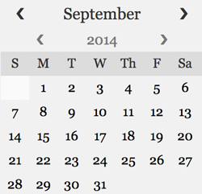
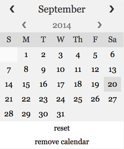

## Highsmith Calendar Picker

Highsmith is a simple calendar picker.  It has several many options for customization, and no dependencies.  Simply attach Highsmith to an input/element.  When you select a date on the calendar, its value will be placed into your input/element.

## Installing Highsmith
Highsmith is available as a bower package.  Simply:

		bower install highsmith

## Invoking Highsmith

To achieve the default Highsmith calendar, simply invoke Highsmith on your desired input.

	// html
	<input type="text" id="default-cal"/>

	// js
	var defaultCal = new Highsmith('default-cal');

## Customizing Highsmith

Highsmith accepts several options for customization.  The full range of options can be found at the bottom of this README.  It holds a default options object, which can be updated in one of two ways:

###### Custom options at initialization
	var options = {
		resetDateButton: true, // allows user to reset to current date
		killButton: true // allows user to kill Highsmith instance.
	};
	var cal = new Highsmith('my-cal', options);

###### Custom options on existing calendar
	// Initialize calendar.
	var defaultCal = new Highsmith('default-cal');

	....
	// Later in the code:
	var options = {
		resetDateButton: true,
		killButton: true
	};
	defaultCal.updateOptions(options);

This calendar will be the result of the above customizations (per the options, buttons have been added to reset the calendar to the current date, and kill the instance of Highsmith).

## All Options
Highsmith comes with default options.  Any of these can be customized by sending a full or partial options object to your Highsmith instance.

		//  Adjust the output format.  Accepts mdy, ydm and dmy
		format: 'mdy',

		// If set to true, the user is given a 'remove calendar button'.  This
		// disables the instance of Highsmith turns the input (or whichever dom element
		// was updated) back to its original state.
		killButton: false,

		// A true value here exposes a reset button.  This button brings the calendar
		// back to its starting date (eg the user has scrolled far ahead, and wants
		// to jump back to today.)
		resetDateButton: false,

		// By default, highsmith creates an additional DOM element that appears in
		// the background, clearing away the calendar with an offclick.  A true
		// value here disables that behavior.
		disableOffClicker: false,

		// A true value prohibits past dates from being selected.
		futureOnly: false,

		// Input fields are assumed to be empty.  Use customDate if your field will
		// already have a value in it.  For example, if your text input will
		// always contain a value two years in advance, setting this parameter to
		// true will cause the calendar to open to that date, rather than today.
		customDate: false,

		style: {

		  disable: false, // Disables styling all together if true

			// Insert custom values for any of the items below.
		  month: {

		      bgColor: '#F1F1F1',
		      color: '#333',
		      fontFamily: false,
		      fontSize: '16px',
		      labelSize: '80%',
		      padding: '4px',
		      toggleSize: '10%'

		  },

		  year: {

		      bgColor: '#F1F1F1',
		      color: '#777',
		      fontFamily: false,
		      fontSize: '14px',
		      labelSize: '60%',
		      padding: '4px',
		      toggleSize: '10%'

		  },

		  days: {

		      bgColor: '#F1F1F1',
		      color: '#333',
		      fontFamily: false,
		      fontSize: '13px',
		      height: '16px',
		      legendBgColor: '#DCDCDC',
		      legendColor: '#333',
		      nullBgColor: '#FAFAFA',
		      padding: '4px',
		      width: '20px'

		  },

		  globals: {
		      fontFamily: 'Georgia, serif',
		      bgColor: '#FFFFFF',
		      border: '1px solid #F1F1F1',
		      borderRadius: '2px',
		      downArrowIcon: '&#10095;',
		      upArrowIcon: '&#10094;',
		      width: '200px'

		  },

		  buttons: {
		      fontSize: '12px',
		      padding: '4px'
		  }

		}

## Classes for styling

If you disable styling entirely, Highsmith can receive custom styling.  Here are a list of classes you can use to style your calendar.

	// To customize Highsmith styling completely, pass the
	// { style: { disable: true }} flag with your options, and use
	// the following classes in your css/sass/etc.

    highsmithCal

    highsmithCal--month

    highsmithCal--month__label

    highsmithCal--month__increment

    highsmithCal--month__decrement

    highsmithCal--year

    highsmithCal--year__label

    highsmithCal--year__increment

    highsmithCal--year__decrement

    highsmithCal--daysLegend

    highsmithCal--daysLegend__label

    highsmithCal--dayHolder

    highsmithCal--dayHolder__nullLabel

    highsmithCal--dayHolder__label

    highsmithCal--killButton

    highsmithCal--resetButton

		highsmithCal--offClicker

## Public Functions

Highsmith exposes four public functions for use after initialization.

		// Create your input in HTML
		<input type="text" id="form-date"/>

		// Make it a Highsmith instance in your JS.
		var calendar = new Highsmith('form-date');

		// Now, elsewhere in the code, you can call one of four functions on your
		// calendar.

		// 1. Kill the calendar listener.  Stops the instance of Highsmith and, if
		// the calendar DOM element exists, removes that as well.
		calendar.kill();

		// 2. Remove the calendar.  Removes the calendar dom element.
		calendar.remove();

		// 3. Update the options.  Allows you to update the options on the fly.
		var exampleOptions = {
			futureOnly: true,
			customDate: true,
			style: {
				disable: true
			}
		};

		calendar.updateOptions(exampleOptions);

		// 4. Show the options.  Logs the options to the console.  Just a quick
		// access function for testing.
		calendar.showOptions();
